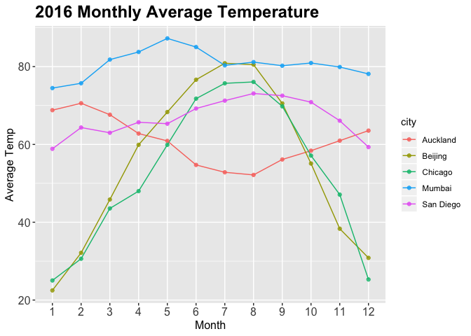
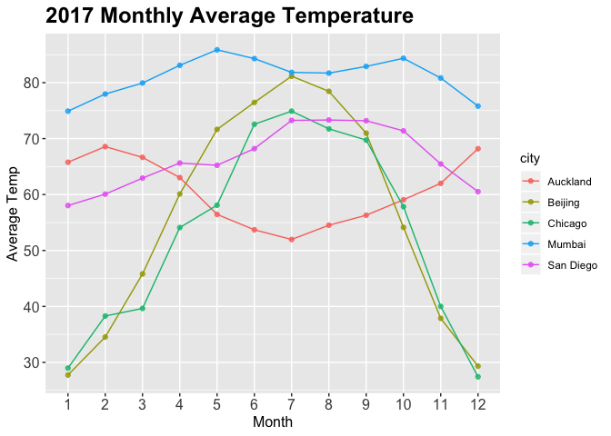
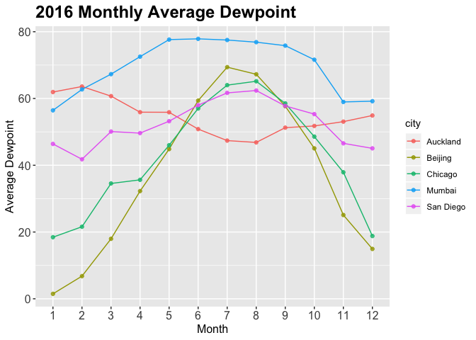
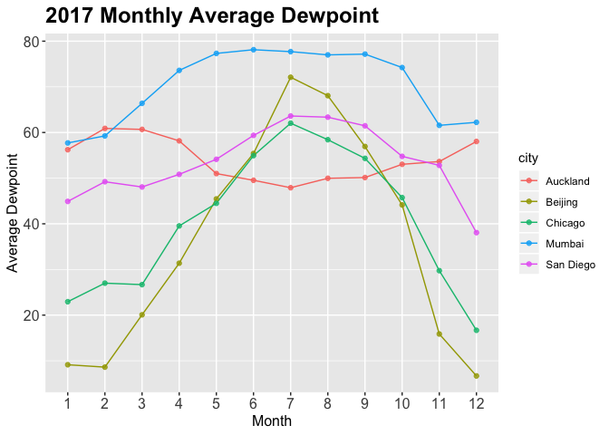
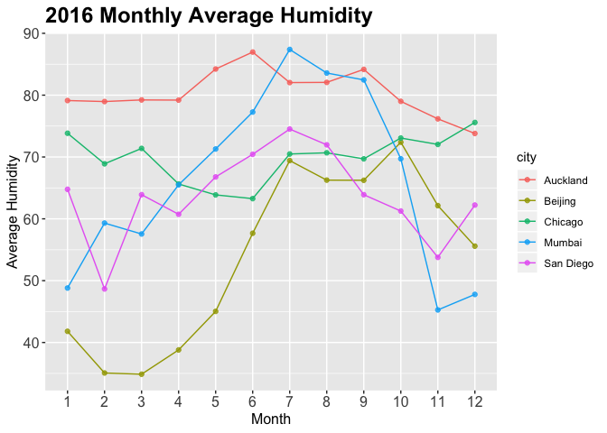

```r
library(tidyverse)
```

```
## <U+2500><U+2500> Attaching packages <U+2500><U+2500><U+2500><U+2500><U+2500><U+2500><U+2500><U+2500><U+2500><U+2500><U+2500><U+2500><U+2500><U+2500><U+2500><U+2500><U+2500><U+2500><U+2500><U+2500><U+2500><U+2500><U+2500><U+2500><U+2500><U+2500><U+2500><U+2500><U+2500><U+2500><U+2500><U+2500><U+2500><U+2500><U+2500><U+2500><U+2500><U+2500><U+2500> tidyverse 1.3.0 <U+2500><U+2500>
```

```
## <U+2713> ggplot2 3.2.1     <U+2713> purrr   0.3.3
## <U+2713> tibble  2.1.3     <U+2713> dplyr   0.8.3
## <U+2713> tidyr   1.0.0     <U+2713> stringr 1.4.0
## <U+2713> readr   1.3.1     <U+2713> forcats 0.4.0
```

```
## <U+2500><U+2500> Conflicts <U+2500><U+2500><U+2500><U+2500><U+2500><U+2500><U+2500><U+2500><U+2500><U+2500><U+2500><U+2500><U+2500><U+2500><U+2500><U+2500><U+2500><U+2500><U+2500><U+2500><U+2500><U+2500><U+2500><U+2500><U+2500><U+2500><U+2500><U+2500><U+2500><U+2500><U+2500><U+2500><U+2500><U+2500><U+2500><U+2500><U+2500><U+2500><U+2500><U+2500><U+2500><U+2500> tidyverse_conflicts() <U+2500><U+2500>
## x dplyr::filter() masks stats::filter()
## x dplyr::lag()    masks stats::lag()
```

```r
library(naniar)
library(skimr)
```

```
## 
## Attaching package: 'skimr'
```

```
## The following object is masked from 'package:naniar':
## 
##     n_complete
```


```r
weather <- readr::read_csv("data/Weather.csv")
```

```
## Warning: Missing column names filled in: 'X1' [1]
```

```
## Parsed with column specification:
## cols(
##   .default = col_double(),
##   city = col_character(),
##   date = col_date(format = ""),
##   events = col_character()
## )
```

```
## See spec(...) for full column specifications.
```

```
## Warning: 183 parsing failures.
##  row    col expected actual               file
## 2194 precip a double      T 'data/Weather.csv'
## 2196 precip a double      T 'data/Weather.csv'
## 2197 precip a double      T 'data/Weather.csv'
## 2203 precip a double      T 'data/Weather.csv'
## 2206 precip a double      T 'data/Weather.csv'
## .... ...... ........ ...... ..................
## See problems(...) for more details.
```

```r
weather
```

```
## # A tibble: 3,655 x 26
##       X1 city  date        year month   day high_temp avg_temp low_temp
##    <dbl> <chr> <date>     <dbl> <dbl> <dbl>     <dbl>    <dbl>    <dbl>
##  1     1 Auck<U+2026> 2016-01-01  2016     1     1        68       65       62
##  2     2 Auck<U+2026> 2016-01-02  2016     1     2        68       66       64
##  3     3 Auck<U+2026> 2016-01-03  2016     1     3        77       72       66
##  4     4 Auck<U+2026> 2016-01-04  2016     1     4        73       66       60
##  5     5 Auck<U+2026> 2016-01-05  2016     1     5        69       62       55
##  6     6 Auck<U+2026> 2016-01-06  2016     1     6        69       63       57
##  7     7 Auck<U+2026> 2016-01-07  2016     1     7        71       66       60
##  8     8 Auck<U+2026> 2016-01-08  2016     1     8        77       70       64
##  9     9 Auck<U+2026> 2016-01-09  2016     1     9        69       66       64
## 10    10 Auck<U+2026> 2016-01-10  2016     1    10        71       66       62
## # <U+2026> with 3,645 more rows, and 17 more variables: high_dewpt <dbl>,
## #   avg_dewpt <dbl>, low_dewpt <dbl>, high_humidity <dbl>, avg_humidity <dbl>,
## #   low_humidity <dbl>, high_hg <dbl>, avg_hg <dbl>, low_hg <dbl>,
## #   high_vis <dbl>, avg_vis <dbl>, low_vis <dbl>, high_wind <dbl>,
## #   avg_wind <dbl>, low_wind <dbl>, precip <dbl>, events <chr>
```


```r
weather %>% 
  select(-"X1")
```

```
## # A tibble: 3,655 x 25
##    city  date        year month   day high_temp avg_temp low_temp high_dewpt
##    <chr> <date>     <dbl> <dbl> <dbl>     <dbl>    <dbl>    <dbl>      <dbl>
##  1 Auck<U+2026> 2016-01-01  2016     1     1        68       65       62         64
##  2 Auck<U+2026> 2016-01-02  2016     1     2        68       66       64         64
##  3 Auck<U+2026> 2016-01-03  2016     1     3        77       72       66         70
##  4 Auck<U+2026> 2016-01-04  2016     1     4        73       66       60         66
##  5 Auck<U+2026> 2016-01-05  2016     1     5        69       62       55         55
##  6 Auck<U+2026> 2016-01-06  2016     1     6        69       63       57         54
##  7 Auck<U+2026> 2016-01-07  2016     1     7        71       66       60         59
##  8 Auck<U+2026> 2016-01-08  2016     1     8        77       70       64         72
##  9 Auck<U+2026> 2016-01-09  2016     1     9        69       66       64         68
## 10 Auck<U+2026> 2016-01-10  2016     1    10        71       66       62         63
## # <U+2026> with 3,645 more rows, and 16 more variables: avg_dewpt <dbl>,
## #   low_dewpt <dbl>, high_humidity <dbl>, avg_humidity <dbl>,
## #   low_humidity <dbl>, high_hg <dbl>, avg_hg <dbl>, low_hg <dbl>,
## #   high_vis <dbl>, avg_vis <dbl>, low_vis <dbl>, high_wind <dbl>,
## #   avg_wind <dbl>, low_wind <dbl>, precip <dbl>, events <chr>
```

**Average Monthly Temperatures for All Cities for 2016 & 2017**

```r
weather %>% 
  mutate_at(vars(month), as.factor) %>% 
 filter(year== 2016) %>%
  group_by(month, city) %>% 
  summarize(mean_avgtemp=mean(avg_temp))  %>% 
  ggplot(aes(x=month, y=mean_avgtemp, color=city, group=city))+
  geom_line() +
  geom_point(alpha=0.8)+
  labs(title="2016 Monthly Average Temperature",
       x= "Month",
       y="Average Temp") +
  theme(plot.title = element_text(size = 18, face = "bold"),
        axis.text = element_text(size = 12),
        axis.title = element_text(size = 12))
```

<!-- -->


```r
weather %>% 
  mutate_at(vars(month), as.factor) %>% 
 filter(year== 2017) %>%
  group_by(month, city) %>% 
  summarize(mean_avgtemp=mean(avg_temp))  %>% 
  ggplot(aes(x=month, y=mean_avgtemp, color=city, group=city))+
  geom_line() +
  geom_point(alpha=0.8)+
  labs(title="2017 Monthly Average Temperature",
       x= "Month",
       y="Average Temp") +
  theme(plot.title = element_text(size = 18, face = "bold"),
        axis.text = element_text(size = 12),
        axis.title = element_text(size = 12))
```

<!-- -->


**Average Monthly Dewpoints for All Cities for 2016 & 2017**


```r
weather %>% 
  mutate_at(vars(month), as.factor) %>% 
 filter(year== 2016) %>%
  group_by(month, city) %>% 
  summarize(mean_avgdewpt=mean(avg_dewpt))  %>% 
  ggplot(aes(x=month, y=mean_avgdewpt, color=city, group=city))+
  geom_line() +
  geom_point(alpha=0.8)+
  labs(title="2016 Monthly Average Dewpoint",
       x= "Month",
       y="Average Dewpoint") +
  theme(plot.title = element_text(size = 18, face = "bold"),
        axis.text = element_text(size = 12),
        axis.title = element_text(size = 12))
```

<!-- -->


```r
weather %>% 
  mutate_at(vars(month), as.factor) %>% 
 filter(year== 2017) %>%
  group_by(month, city) %>% 
  summarize(mean_avgdewpt=mean(avg_dewpt))  %>% 
  ggplot(aes(x=month, y=mean_avgdewpt, color=city, group=city))+
  geom_line() +
  geom_point(alpha=0.8)+
  labs(title="2017 Monthly Average Dewpoint",
       x= "Month",
       y="Average Dewpoint") +
  theme(plot.title = element_text(size = 18, face = "bold"),
        axis.text = element_text(size = 12),
        axis.title = element_text(size = 12))
```

<!-- -->


**Average Monthly Humidity for All Cities for 2016 & 2017**

```r
weather %>% 
  mutate_at(vars(month), as.factor) %>% 
 filter(year== 2016) %>%
  group_by(month, city) %>% 
  summarize(mean_avghumidity=mean(avg_humidity))  %>% 
  ggplot(aes(x=month, y=mean_avghumidity, color=city, group=city))+
  geom_line() +
  geom_point(alpha=0.8)+
  labs(title="2016 Monthly Average Humidity",
       x= "Month",
       y="Average Humidity") +
  theme(plot.title = element_text(size = 18, face = "bold"),
        axis.text = element_text(size = 12),
        axis.title = element_text(size = 12))
```

<!-- -->


```r
weather %>% 
  mutate_at(vars(month), as.factor) %>% 
 filter(year== 2017) %>%
  group_by(month, city) %>% 
  summarize(mean_avghumidity=mean(avg_humidity))  %>% 
  ggplot(aes(x=month, y=mean_avghumidity, color=city, group=city))+
  geom_line() +
  geom_point(alpha=0.8)+
  labs(title="2017 Monthly Average Humidity",
       x= "Month",
       y="Average Humidity") +
  theme(plot.title = element_text(size = 18, face = "bold"),
        axis.text = element_text(size = 12),
        axis.title = element_text(size = 12))
```

<!-- -->

