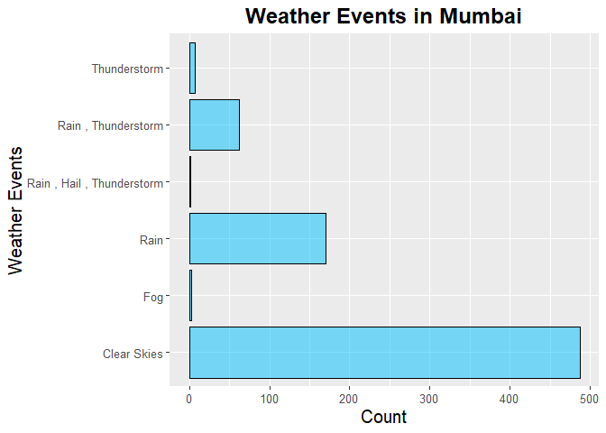

```r
library(tidyverse)
```

```
## -- Attaching packages ----------------------------------------------------- tidyverse 1.3.0 --
```

```
## v ggplot2 3.2.1     v purrr   0.3.3
## v tibble  2.1.3     v dplyr   0.8.4
## v tidyr   1.0.2     v stringr 1.4.0
## v readr   1.3.1     v forcats 0.4.0
```

```
## -- Conflicts -------------------------------------------------------- tidyverse_conflicts() --
## x dplyr::filter() masks stats::filter()
## x dplyr::lag()    masks stats::lag()
```

```r
library(naniar)
library(skimr)
```

```
## 
## Attaching package: 'skimr'
```

```
## The following object is masked from 'package:naniar':
## 
##     n_complete
```


```r
weather <- readr::read_csv("data/weather.csv")
```

```
## Warning: Missing column names filled in: 'X1' [1]
```

```
## Parsed with column specification:
## cols(
##   .default = col_double(),
##   city = col_character(),
##   date = col_date(format = ""),
##   events = col_character()
## )
```

```
## See spec(...) for full column specifications.
```

```
## Warning: 183 parsing failures.
##  row    col expected actual               file
## 2194 precip a double      T 'data/weather.csv'
## 2196 precip a double      T 'data/weather.csv'
## 2197 precip a double      T 'data/weather.csv'
## 2203 precip a double      T 'data/weather.csv'
## 2206 precip a double      T 'data/weather.csv'
## .... ...... ........ ...... ..................
## See problems(...) for more details.
```

```r
weather
```

```
## # A tibble: 3,655 x 26
##       X1 city  date        year month   day high_temp avg_temp low_temp
##    <dbl> <chr> <date>     <dbl> <dbl> <dbl>     <dbl>    <dbl>    <dbl>
##  1     1 Auck~ 2016-01-01  2016     1     1        68       65       62
##  2     2 Auck~ 2016-01-02  2016     1     2        68       66       64
##  3     3 Auck~ 2016-01-03  2016     1     3        77       72       66
##  4     4 Auck~ 2016-01-04  2016     1     4        73       66       60
##  5     5 Auck~ 2016-01-05  2016     1     5        69       62       55
##  6     6 Auck~ 2016-01-06  2016     1     6        69       63       57
##  7     7 Auck~ 2016-01-07  2016     1     7        71       66       60
##  8     8 Auck~ 2016-01-08  2016     1     8        77       70       64
##  9     9 Auck~ 2016-01-09  2016     1     9        69       66       64
## 10    10 Auck~ 2016-01-10  2016     1    10        71       66       62
## # ... with 3,645 more rows, and 17 more variables: high_dewpt <dbl>,
## #   avg_dewpt <dbl>, low_dewpt <dbl>, high_humidity <dbl>, avg_humidity <dbl>,
## #   low_humidity <dbl>, high_hg <dbl>, avg_hg <dbl>, low_hg <dbl>,
## #   high_vis <dbl>, avg_vis <dbl>, low_vis <dbl>, high_wind <dbl>,
## #   avg_wind <dbl>, low_wind <dbl>, precip <dbl>, events <chr>
```


```r
weather %>% 
  select(-"X1")
```

```
## # A tibble: 3,655 x 25
##    city  date        year month   day high_temp avg_temp low_temp high_dewpt
##    <chr> <date>     <dbl> <dbl> <dbl>     <dbl>    <dbl>    <dbl>      <dbl>
##  1 Auck~ 2016-01-01  2016     1     1        68       65       62         64
##  2 Auck~ 2016-01-02  2016     1     2        68       66       64         64
##  3 Auck~ 2016-01-03  2016     1     3        77       72       66         70
##  4 Auck~ 2016-01-04  2016     1     4        73       66       60         66
##  5 Auck~ 2016-01-05  2016     1     5        69       62       55         55
##  6 Auck~ 2016-01-06  2016     1     6        69       63       57         54
##  7 Auck~ 2016-01-07  2016     1     7        71       66       60         59
##  8 Auck~ 2016-01-08  2016     1     8        77       70       64         72
##  9 Auck~ 2016-01-09  2016     1     9        69       66       64         68
## 10 Auck~ 2016-01-10  2016     1    10        71       66       62         63
## # ... with 3,645 more rows, and 16 more variables: avg_dewpt <dbl>,
## #   low_dewpt <dbl>, high_humidity <dbl>, avg_humidity <dbl>,
## #   low_humidity <dbl>, high_hg <dbl>, avg_hg <dbl>, low_hg <dbl>,
## #   high_vis <dbl>, avg_vis <dbl>, low_vis <dbl>, high_wind <dbl>,
## #   avg_wind <dbl>, low_wind <dbl>, precip <dbl>, events <chr>
```


```r
glimpse(weather)
```

```
## Observations: 3,655
## Variables: 26
## $ X1            <dbl> 1, 2, 3, 4, 5, 6, 7, 8, 9, 10, 11, 12, 13, 14, 15, 16...
## $ city          <chr> "Auckland", "Auckland", "Auckland", "Auckland", "Auck...
## $ date          <date> 2016-01-01, 2016-01-02, 2016-01-03, 2016-01-04, 2016...
## $ year          <dbl> 2016, 2016, 2016, 2016, 2016, 2016, 2016, 2016, 2016,...
## $ month         <dbl> 1, 1, 1, 1, 1, 1, 1, 1, 1, 1, 1, 1, 1, 1, 1, 1, 1, 1,...
## $ day           <dbl> 1, 2, 3, 4, 5, 6, 7, 8, 9, 10, 11, 12, 13, 14, 15, 16...
## $ high_temp     <dbl> 68, 68, 77, 73, 69, 69, 71, 77, 69, 71, 75, 69, 71, 7...
## $ avg_temp      <dbl> 65, 66, 72, 66, 62, 63, 66, 70, 66, 66, 67, 66, 66, 6...
## $ low_temp      <dbl> 62, 64, 66, 60, 55, 57, 60, 64, 64, 62, 59, 62, 62, 6...
## $ high_dewpt    <dbl> 64, 64, 70, 66, 55, 54, 59, 72, 68, 63, 61, 66, 61, 6...
## $ avg_dewpt     <dbl> 60, 63, 67, 60, 52, 51, 54, 67, 61, 58, 58, 62, 57, 6...
## $ low_dewpt     <dbl> 55, 61, 64, 54, 48, 46, 50, 59, 55, 55, 54, 59, 54, 5...
## $ high_humidity <dbl> 100, 100, 100, 100, 82, 88, 83, 100, 100, 88, 94, 100...
## $ avg_humidity  <dbl> 82, 94, 91, 76, 69, 65, 65, 92, 81, 76, 72, 87, 73, 8...
## $ low_humidity  <dbl> 68, 88, 74, 53, 56, 46, 53, 83, 64, 64, 53, 78, 64, 6...
## $ high_hg       <dbl> 30.15, 30.04, 29.80, 30.12, 30.21, 30.24, 30.24, 30.0...
## $ avg_hg        <dbl> 30.09, 29.90, 29.73, 29.90, 30.14, 30.22, 30.13, 29.7...
## $ low_hg        <dbl> 30.01, 29.80, 29.68, 29.77, 30.09, 30.18, 30.04, 29.6...
## $ high_vis      <dbl> 6, 6, 6, 6, 6, 6, 6, 6, 6, 6, 6, 6, 6, 6, 6, 6, 6, 6,...
## $ avg_vis       <dbl> 6, 5, 6, 6, 6, 6, 6, 6, 6, 6, 6, 6, 6, 6, 6, 6, 6, 6,...
## $ low_vis       <dbl> 4, 1, 1, 6, 6, 6, 6, 2, 4, 6, 6, 3, 6, 6, 6, 6, 6, 2,...
## $ high_wind     <dbl> 21, 33, 18, 15, 13, 17, 22, 21, 18, 20, 17, 16, 18, 1...
## $ avg_wind      <dbl> 15, 21, 12, 10, 7, 8, 12, 14, 11, 15, 10, 8, 13, 9, 7...
## $ low_wind      <dbl> 28, 46, NA, NA, NA, 28, 25, 28, 29, NA, 26, NA, NA, N...
## $ precip        <dbl> 0, 0, 0, 0, 0, 0, 0, 0, 0, 0, 0, 0, 0, 0, 0, 0, 0, 0,...
## $ events        <chr> "Rain", "Rain", "Rain", "Rain", NA, NA, "Rain", "Rain...
```


```r
colnames(weather)
```

```
##  [1] "X1"            "city"          "date"          "year"         
##  [5] "month"         "day"           "high_temp"     "avg_temp"     
##  [9] "low_temp"      "high_dewpt"    "avg_dewpt"     "low_dewpt"    
## [13] "high_humidity" "avg_humidity"  "low_humidity"  "high_hg"      
## [17] "avg_hg"        "low_hg"        "high_vis"      "avg_vis"      
## [21] "low_vis"       "high_wind"     "avg_wind"      "low_wind"     
## [25] "precip"        "events"
```


```r
new_factor<- c(1:5,26)
new_numeric<- c(6:25)
weather[,new_factor] <- lapply(weather[,new_factor], as.factor)
weather[,new_numeric] <- lapply(weather[,new_numeric], as.numeric)
lapply(weather, class) #changing classes
```

```
## $X1
## [1] "factor"
## 
## $city
## [1] "factor"
## 
## $date
## [1] "factor"
## 
## $year
## [1] "factor"
## 
## $month
## [1] "factor"
## 
## $day
## [1] "numeric"
## 
## $high_temp
## [1] "numeric"
## 
## $avg_temp
## [1] "numeric"
## 
## $low_temp
## [1] "numeric"
## 
## $high_dewpt
## [1] "numeric"
## 
## $avg_dewpt
## [1] "numeric"
## 
## $low_dewpt
## [1] "numeric"
## 
## $high_humidity
## [1] "numeric"
## 
## $avg_humidity
## [1] "numeric"
## 
## $low_humidity
## [1] "numeric"
## 
## $high_hg
## [1] "numeric"
## 
## $avg_hg
## [1] "numeric"
## 
## $low_hg
## [1] "numeric"
## 
## $high_vis
## [1] "numeric"
## 
## $avg_vis
## [1] "numeric"
## 
## $low_vis
## [1] "numeric"
## 
## $high_wind
## [1] "numeric"
## 
## $avg_wind
## [1] "numeric"
## 
## $low_wind
## [1] "numeric"
## 
## $precip
## [1] "numeric"
## 
## $events
## [1] "factor"
```

## Weather Events by City


```r
weather$events<- as.character(weather$events)
weather$events[is.na(weather$events)] <- "Clear Skies"
```


```r
skies <- weather %>% 
  select(city, events)
```


```r
skies %>%
  filter(city== "Auckland") %>% 
  ggplot(aes(x=events)) +
  geom_bar(fill = "brown1", color="black", alpha =.5) +
  labs(title = "Weather Events in Auckland",
       x= "Weather Events",
       y= "Count") +
  theme(plot.title = element_text(size = 18, face = "bold", hjust = 0.5),
        axis.text = element_text(size = 10),
        axis.title = element_text(size = 15),)+
  coord_flip()
```

<!-- -->


```r
skies %>%
  filter(city== "Beijing") %>% 
  ggplot(aes(x=events)) +
  geom_bar(fill = "darkgoldenrod2", color="black", alpha =.5) +
  labs(title = "Weather Events in Beijing",
       x= "Weather Events",
       y= "Count") +
  theme(plot.title = element_text(size = 18, face = "bold", hjust = 0.5),
        axis.text = element_text(size = 10),
        axis.title = element_text(size = 15),)+
  coord_flip()
```

<!-- -->


```r
skies %>%
  filter(city== "Chicago") %>% 
  ggplot(aes(x=events)) +
  geom_bar(fill = "palegreen1", color="black", alpha =.5) +
  labs(title = "Weather Events in Chicago",
       x= "Weather Events",
       y= "Count") +
  theme(plot.title = element_text(size = 18, face = "bold", hjust = 0.5),
        axis.text = element_text(size = 10),
        axis.title = element_text(size = 15),)+
  coord_flip()
```

<!-- -->


```r
skies %>%
  filter(city== "Mumbai") %>% 
  ggplot(aes(x=events)) +
  geom_bar(fill = "deepskyblue", color="black", alpha =.5) +
  labs(title = "Weather Events in Mumbai",
       x= "Weather Events",
       y= "Count") +
  theme(plot.title = element_text(size = 18, face = "bold", hjust = 0.5),
        axis.text = element_text(size = 10),
        axis.title = element_text(size = 15),)+
  coord_flip()
```

<!-- -->


```r
skies %>%
  filter(city== "San Diego") %>% 
  ggplot(aes(x=events)) +
  geom_bar(fill = "magenta", color="black", alpha =.5) +
  labs(title = "Weather Events in San D",
       x= "Weather Events",
       y= "Count") +
  theme(plot.title = element_text(size = 18, face = "bold", hjust = 0.5),
        axis.text = element_text(size = 10),
        axis.title = element_text(size = 15),)+
  coord_flip()
```

<!-- -->
